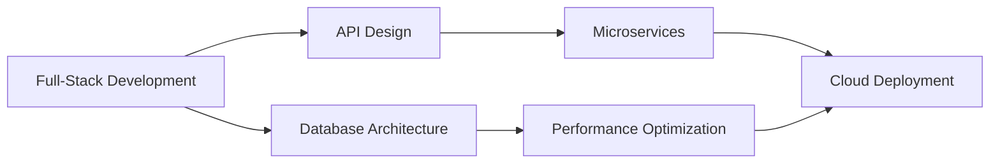

<div align="center">
  
# 👋 Hello, I'm Frank Kwabena Aboagye

```ascii
███████╗██████╗  █████╗ ███╗   ██╗██╗  ██╗    
██╔════╝██╔══██╗██╔══██╗████╗  ██║██║ ██╔╝    
█████╗  ██████╔╝███████║██╔██╗ ██║█████╔╝     
██╔══╝  ██╔══██╗██╔══██║██║╚██╗██║██╔═██╗     
██║     ██║  ██║██║  ██║██║ ╚████║██║  ██╗     
╚═╝     ╚═╝  ╚═╝╚═╝  ╚═╝╚═╝  ╚═══╝╚═╝  ╚═╝      
```

### 🚀 **Software Engineer** | **Continuous Learner** | **Technology Enthusiast**

[](https://git.io/typing-svg)

</div>

---

## 🎯 **About Me**

I'm a passionate Software Engineer with a strong affinity for backend development. Currently on a continuous learning journey, exploring new technologies and deepening my understanding of server-side architectures. I believe in building robust, scalable systems while constantly expanding my knowledge base.

```javascript
const frank = {
    code: ["Java", "JavaScript", "Python", "TypeScript", "C", "..."],
    technologies: {
        frontEnd: ["Angular", "HTML5", "CSS", "Tailwind", "..."],
        backEnd: ["Spring Boot", "Node.js", "Django", "FastAPI", "Express", "..."],
        databases: ["PostgreSQL", "MongoDB", "..."],
        cloud: ["AWS", "Docker", "Kubernetes", "..."]
    },
    currentlyLearning: ["Advanced system design", "Cloud architecture", "New frameworks"],
    philosophy: "Every day is a chance to learn something new",
    mindset: "Backend-focused, always curious"
};
```

---

## 🛠️ **Technology Stack**

<div align="center">

### **Programming Languages**


### **Frontend Technologies**


### **Backend Technologies**


### **Databases & Cloud**


</div>

---

## 📊 **GitHub Analytics**

<div align="center">


</div>

<div align="center">

[](https://git.io/streak-stats)

</div>

<div align="center">


</div>

---

## 🏆 **GitHub Trophies**

<div align="center">

[](https://github.com/ryo-ma/github-profile-trophy)

</div>

---

## 💼 **Professional Focus Areas**



- 🔧 **Software Architecture**: Designing scalable and maintainable systems
- 🌐 **Web Development**: Building responsive, user-centric applications
- 🔗 **API Development**: Creating robust RESTful and GraphQL services
- 📊 **Database Design**: Optimizing data models and query performance
- ☁️ **Cloud Engineering**: Deploying and managing cloud-native solutions
- 🧪 **Testing & QA**: Implementing comprehensive testing strategies

---

## 🌟 **Current Learning Journey**

- 🚀 Diving deep into backend system design and architecture
- 📚 Constantly exploring new frameworks and technologies
- 🌩️ Learning advanced cloud deployment strategies
- 🔧 Understanding microservices and distributed systems
- 🤝 Contributing to open-source projects to learn from the community
- 💡 Always seeking to understand the "why" behind technologies

---

## 📫 **Let's Connect**

<div align="center">

[](https://linkedin.com/in/frank-aboagye)
[](mailto:frankgye18@gmail.com)
[](https://your-portfolio.com)
[](https://twitter.com/your-handle)

</div>

---

<div align="center">

### 💡 *"Great software is built by great people working together"*


⭐️ From [dacostafrankaboagye](https://github.com/dacostafrankaboagye)

</div>
