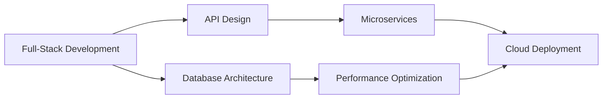

<div align="center">
  
# 👋 Hello, I'm Frank Kwabena Aboagye

```ascii
███████╗██████╗  █████╗ ███╗   ██╗██╗  ██╗    
██╔════╝██╔══██╗██╔══██╗████╗  ██║██║ ██╔╝    
█████╗  ██████╔╝███████║██╔██╗ ██║█████╔╝     
██╔══╝  ██╔══██╗██╔══██║██║╚██╗██║██╔═██╗     
██║     ██║  ██║██║  ██║██║ ╚████║██║  ██╗     
╚═╝     ╚═╝  ╚═╝╚═╝  ╚═╝╚═╝  ╚═══╝╚═╝  ╚═╝      
```

### **Engineer** | **Builder** 

[](https://git.io/typing-svg)

</div>

---
<!--
 ## 🎯 **About Me**

Currently on a continuous learning journey, exploring new technologies and deepening my understanding of server-side architectures. -->

```javascript
const frank = {
    philosophy: "Every day is a chance to learn something new",
    mindset: "Just Build"
};
```

---

<!-- ## 🛠️ **Technology Stack**

<div align="center">

### **Programming Languages**


### **Frontend Technologies**


### **Backend Technologies**


### **Databases & Cloud**


</div> -->

<!-- ---

## 📊 **GitHub Analytics**

<div align="center">


</div>

<div align="center">


</div> -->

---

<!--
## 💼 **Areas** -->


---

<!-- ## 📫 **Let's Connect** -->

<!-- <div align="center">

[](https://linkedin.com/in/frankaboagye)
[](mailto:frankgye18@gmail.com)
[](https://your-portfolio.com)
[](https://twitter.com/kwabenafrankjnr)
[](https://www.youtube.com/@frankkwabenaaboagye)

</div> -->

<!--
## 🔗 Socials -->


[](https://medium.com/@aboagyekwabena_)
[](https://www.linkedin.com/in/frankaboagye/)
[](https://x.com/kwabenafrankjnr)
[](https://www.instagram.com/kwabena.frank.jnr/)
[](https://www.youtube.com/@frankkwabenaaboagye)


---

<div align="center">

### 💡 *"First, make your code simple and correct; then make it fast and small, but only if necessary.* - How to Progam - Deitel

<!--  -->

<!-- ⭐️ From [dacostafrankaboagye](https://github.com/dacostafrankaboagye) -->

</div>
